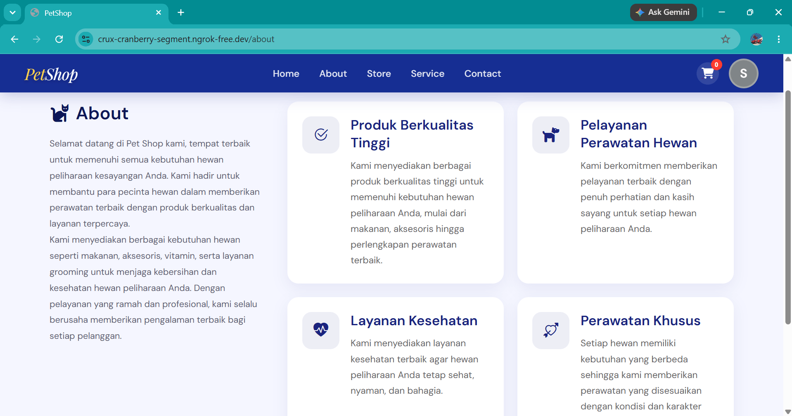
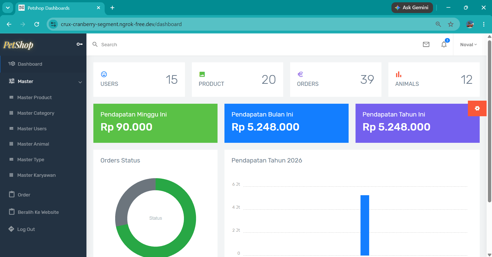
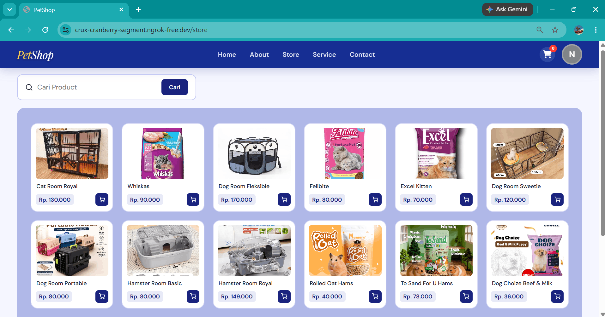
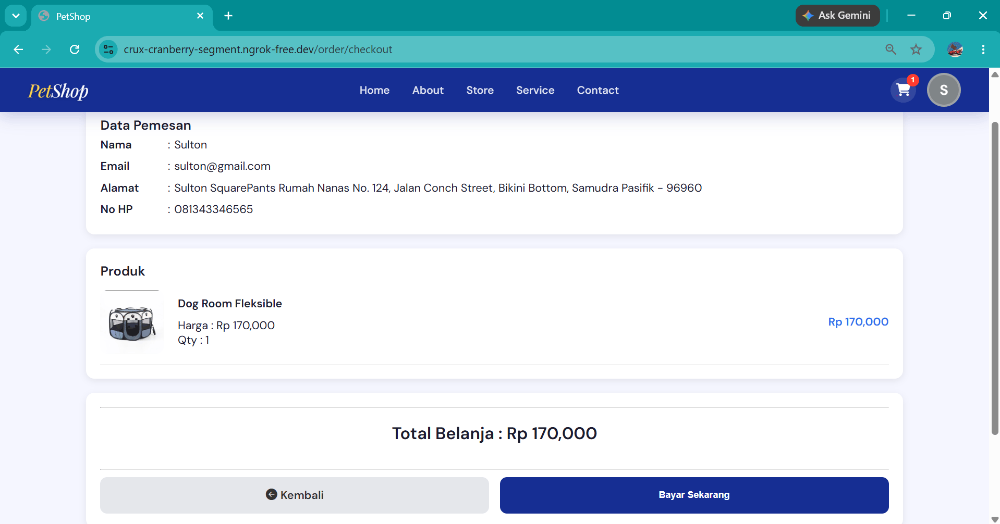
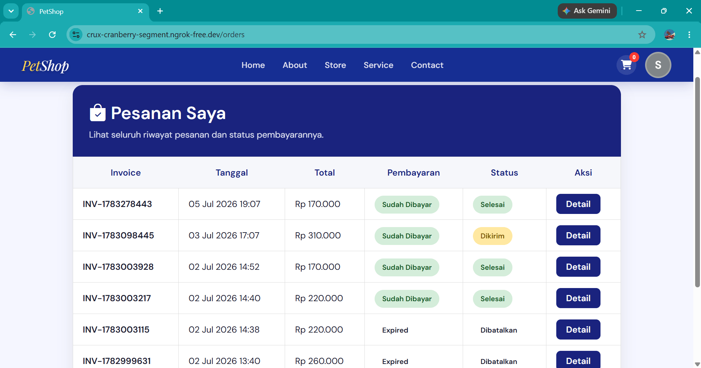

# 🐾 PetShop Management System | Laravel 12


PetShop Management System is a web-based application built with Laravel 12 to help manage pet store operations, including product management, online shopping, payment integration, and dashboard analytics.

## 🚀 Features

- Authentication (Login, Register & Forgot Password)
- Product Management (CRUD)
- Category Management (CRUD)
- Animal Management (CRUD)
- User Management (CRUD)
- Shopping Cart
- Checkout System
- Midtrans Payment Gateway (Sandbox / Dummy)
- Payment Callback (Webhook)
- Order Management
- Dashboard Analytics
- Revenue Chart
- Load More Products
- Realtime Product Search
- WhatsApp Reservation
- Responsive Design

## 🛠️ Tech Stack

- Laravel 12
- PHP 8.2
- MySQL
- Bootstrap 5
- Tailwind CSS
- JavaScript
- Midtrans Sandbox
- Chartist.js
- SweetAlert2

## 🔧 Development Tools

- Git
- GitHub
- Visual Studio Code
- XAMPP
- ngrok (Webhook Testing)
  
## 📷 Screenshots

### Landing Page



### Admin Dashboard



### Product Store



### Checkout



### Order History



## ⚙️ Installation

Clone this repository

```bash
git clone https://github.com/novalard2/petshop.git
```

Go to project folder

```bash
cd petshop
```

Install dependencies

```bash
composer install
```

Copy environment file

```bash
cp .env.example .env
```
> **Windows users: copy .env.example to .env manually if the cp command is unavailable.

Generate application key

```bash
php artisan key:generate
```

Update your database configuration and Midtrans credentials in the `.env` file, then run:

```bash
php artisan migrate
```

Create a symbolic link for the storage directory

```bash
php artisan storage:link
```

Start the development server

```bash
php artisan serve
```

---

## 📄 License

This project was developed for learning and portfolio purposes.

---

## 👨‍💻 Developer

**Noval Ardiansyah**

GitHub: [github.com/novalard2](https://github.com/novalard2)
